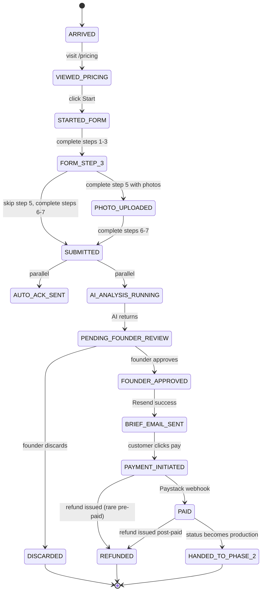

# Customer journey

**Status:** Authoritative for Phase 1.
**Owner:** Akinwunmi.
**Last updated:** 2026-05-03.

This document describes every state a Phase 1 customer can occupy, what triggers each transition, what we observe to know it happened, what we write to the database, and what the customer experiences. It's the spec the application code is graded against.

If a behaviour in production disagrees with this document, the code is wrong, not the document. Open an issue and we'll update one or the other deliberately — never let them silently drift.

## 1. The nine states

Phase 1 has nine states, terminal in `paid` (which then hands off to Phase 2 production). Every customer follows the same path; the only branches are dropouts and refunds.

```
ARRIVED
  ↓
VIEWED_PRICING
  ↓
STARTED_FORM
  ↓
FORM_STEP_3            ← save token issued, recovery emails enabled
  ↓
PHOTO_UPLOADED         ← optional; brief skips this if customer skipped step 5
  ↓
SUBMITTED              ← writes brief, fires auto-ack, queues AI analysis
  ├─ AUTO_ACK_SENT     ← parallel to AI analysis
  └─ AI_ANALYSIS_RUNNING
       ↓
       PENDING_FOUNDER_REVIEW  ← founder action required
       ↓
       FOUNDER_APPROVED        ← (or DISCARDED — terminal failure)
       ↓
       BRIEF_EMAIL_SENT
       ↓
       PAYMENT_INITIATED       ← customer clicked the Paystack link
       ↓
       PAID                    ← terminal for Phase 1
       ↓
       HANDED_TO_PHASE_2       ← production triggered
```

Two off-path terminal states exist:

- `DISCARDED` — founder soft-rejected the brief in CRM (rare; spam, fake submissions). Customer keeps their auto-ack but receives no further automated emails.
- `REFUNDED` — payment reversed before delivery. Reversible via re-payment.

## 2. State-by-state contracts

For each state, this section documents:

- **Trigger** — what causes the transition into this state.
- **Writes** — what rows are created/updated, in transaction order.
- **Side effects** — emails, WhatsApps, jobs queued, third-party API calls.
- **Customer-visible** — what the customer sees, hears, or doesn't.
- **Observable signal** — how we know in the CRM/DB that we're in this state.
- **Failure modes** — what can go wrong, and how we recover.

### 2.1 ARRIVED

**Trigger.** First page load on the marketing site for this session.

**Writes.** None. We don't track anonymous visitors in Phase 1. Cloudflare Analytics gives us aggregate traffic; that's enough.

**Side effects.** None.

**Customer-visible.** Marketing site landing page renders.

**Observable signal.** Cloudflare Analytics page-view count.

**Failure modes.** Site down → UptimeRobot alert. CDN issues → user retry handles it.

### 2.2 VIEWED_PRICING

**Trigger.** Navigation to `/pricing`.

**Writes.** None.

**Side effects.** Pricing page loads with three tier cards and the interactive calendar preview component.

**Customer-visible.** Pricing cards (Starter, Standard, Calendar). Niche-picker. Calendar preview grid that updates as they switch niche or tier.

**Observable signal.** Page-view count, time-on-page, niche-picker engagement (if we add a small analytics ping — Phase 1 deliberately doesn't track this).

**Failure modes.** Calendar preview JSON files missing → component renders empty state with fallback copy. Niche-picker JS error → component remains visible with default niche.

### 2.3 STARTED_FORM

**Trigger.** Click "Start your calendar" CTA, or direct nav to `/brief`.

**Writes.**

```sql
insert into customers (id, email, source) values (...);
-- email is null at this stage; we update it at step 2.

insert into briefs (id, customer_id, current_step, form_payload) values (..., 1, '{}'::jsonb);

insert into activity_log (event_type, customer_id, brief_id, actor)
  values ('form_started', ..., ..., 'customer');
```

The `customers` row is a stub — we don't know their email yet. We use a session cookie to keep the brief associated with this anonymous customer until step 2 fills in the email.

**Side effects.** None.

**Customer-visible.** Form step 1 (tier picker).

**Observable signal.** New `briefs` row with `current_step = 1` and `submitted_at IS NULL`.

**Failure modes.** Browser cookie blocked → form state lost on refresh, customer must restart. We tolerate this; trying to handle it server-side without auth is more complexity than it's worth at this scale.

### 2.4 FORM_STEP_3

**Trigger.** Customer submits step 3 (Content direction & goals).

**Writes.**

```sql
update briefs set
  current_step = 3,
  form_payload = jsonb_set(form_payload, '{direction}', $1::jsonb),
  save_token = $2,
  last_updated_at = now()
where id = $3;

insert into activity_log (event_type, brief_id, customer_id, actor, payload)
  values ('form_step_completed', ..., ..., 'customer', '{"step": 3}'::jsonb);

insert into activity_log (event_type, brief_id, customer_id, actor)
  values ('form_saved', ..., ..., 'system');
```

The `save_token` is a 24-character URL-safe random string. It's the resume URL: `https://operscale.cloud/brief/{save_token}`.

**Side effects.** Save-token email sent to the customer (Resend, template `brief_save_token`):

> Subject: Your Operscale brief is saved — finish anytime
>
> Hi {{first_name}}, your brief is saved. When you're ready, pick up where you left off: {{resume_url}}. The link works for 7 days.

This is an unprompted email; it's the only state in the journey where we email without explicit opt-in. We do it because losing 70% of step-3 starters to abandonment is the reality without it.

**Customer-visible.** Step 4 of the form. Confirmation toast: "Your progress is saved. We've emailed you a resume link."

**Observable signal.** `briefs.current_step >= 3` AND `briefs.save_token IS NOT NULL` AND `briefs.submitted_at IS NULL`. The drop-off recovery cron uses this as its candidate query.

**Failure modes.** Resend API down → save token still issued (it's local), email fails silently, customer sees the toast which now slightly lies. We accept this; the alternative is blocking form progress on a third-party API which is worse UX.

### 2.5 PHOTO_UPLOADED (optional)

**Trigger.** Customer uploads at least one photo on step 5 AND signs the consent checkbox AND clicks "Next".

**Writes.** For each photo:

```sql
insert into brief_photos (
  brief_id, customer_id, photo_index,
  storage_path, mime_type, size_bytes,
  width_px, height_px,
  face_detected, sharpness_score, brightness_score, quality_check_passed,
  scheduled_delete_at  -- uploaded_at + 30 days; updated to delivered_at + 90d when order ships
) values (...);

-- Once per brief (not per photo):
insert into brief_consent (
  brief_id, consent_type, consent_text_version, consent_text_hash,
  signed_at, ip_address, user_agent
) values (..., 'photo_upload', 'v1.0', 'sha256:...', now(), ..., ...);

insert into activity_log (event_type, brief_id, actor, payload)
  values ('photo_uploaded', ..., 'customer', '{"index": 1, "size_bytes": ...}'::jsonb);

insert into activity_log (event_type, brief_id, actor)
  values ('consent_signed', ..., 'customer');
```

**Side effects.** Photo files written to Supabase Storage at `customer-photos/{customer_id}/{brief_id}/photo_{N}.jpg`. Quality check (face detection + sharpness + brightness) runs in the browser before upload using TensorFlow.js BlazeFace. If the check fails, the customer sees a warning and a "Use anyway" button — quality is advisory, never blocking.

**Customer-visible.** Photo thumbnails appear inline. Each thumbnail shows a small "quality OK" or "quality flag" pill. The consent checkbox must be ticked before the Next button enables.

**Observable signal.** `brief_photos` rows linked to the brief; `brief_consent` row of type `photo_upload`.

**Failure modes.** Storage upload fails → frontend retries 3x, then shows "Upload failed, please try again" message. The brief remains at step 5 with no photos until upload succeeds or customer skips. Quality check JS fails → photos upload anyway with all quality scores NULL; the CRM shows "quality unknown" badge.

### 2.6 SUBMITTED

**Trigger.** Customer clicks "Submit" on step 7.

**Writes.** Single transaction:

```sql
begin;

update customers set
  email = $1, full_name = $2, whatsapp_number = $3,
  business_name = $4, niche = $5, source = $6,
  last_seen_at = now(), updated_at = now()
where id = $7;

update briefs set
  tier_intent = $1,
  form_payload = $2,
  current_step = 7,
  submitted_at = now(),
  last_updated_at = now()
where id = $3;

insert into orders (
  customer_id, brief_id, tier, amount_ngn, status
) values (..., ..., $1, $2, 'pending_founder_review');

insert into brief_consent (brief_id, consent_type, ...) values (..., 'terms', ...);

insert into activity_log (event_type, brief_id, customer_id, order_id, actor)
  values ('form_submitted', ..., ..., ..., 'customer');

commit;
```

**Side effects.** Two parallel processes start:

1. **Auto-ack email** — fires within 30 seconds via direct Resend call (synchronous, not queued). Subject: `Got your Operscale brief — personalised version coming within an hour`. See `docs/specs/email-templates.md` for full body.

2. **AI analysis job** — queued for the agent service. Picked up within seconds. See `docs/specs/ai-brief-analysis.md`.

**Customer-visible.** Form replaced by success page:

> Thanks {{first_name}}. We've received your brief and you'll get a quick confirmation email in the next minute. Within an hour we'll send your personalised content brief with sample angles and a payment link. If you submitted late evening Lagos time, expect the personalised brief by 9 AM tomorrow.
>
> Need to add anything? Reply to the confirmation email or WhatsApp the founder directly: {{whatsapp_link}}.

**Observable signal.** `orders.status = 'pending_founder_review'`, `briefs.submitted_at IS NOT NULL`.

**Failure modes.**
- Auto-ack email fails to send → logged in `activity_log` as `email_failed`, monitored — but the brief still progresses. The customer might see "no email yet" but the success page already set expectations.
- AI analysis fails on first try → up to 5 retries with exponential backoff. After 5 failures the order stays in `pending_founder_review` with a flag indicating no AI output is available; founder writes the brief manually using the form data and a generic template.

### 2.7 AUTO_ACK_SENT (parallel)

**Trigger.** Resend API returns 200 to the auto-ack send call.

**Writes.**

```sql
update briefs set auto_ack_sent_at = now() where id = $1;

insert into email_log (
  customer_id, brief_id, template_key, resend_message_id, to_email, subject, body_snapshot
) values (..., ..., 'auto_ack', $1, ..., ..., $2);

insert into activity_log (event_type, brief_id, customer_id, actor)
  values ('email_auto_ack_sent', ..., ..., 'system');
```

**Side effects.** Email lands in customer inbox.

**Customer-visible.** Email titled "Got your Operscale brief — personalised version coming within an hour".

**Observable signal.** `email_log` row with `template_key = 'auto_ack'`.

**Failure modes.** Resend rate-limited → retry once after 5s. Persistent failure → log warning, do not block downstream states.

### 2.8 AI_ANALYSIS_RUNNING

**Trigger.** Agent service picks up the queued job.

**Writes.** Before calling Anthropic:

```sql
insert into activity_log (event_type, brief_id, actor)
  values ('ai_analysis_started', ..., 'system');
```

After Anthropic returns (success):

```sql
insert into analysis_runs (
  brief_id, run_index, trigger_type, founder_note,
  ai_output, model, input_tokens, output_tokens, cost_usd, duration_ms,
  is_current
) values (..., 1, 'initial', null, $1::jsonb, 'claude-opus-4-7', ..., ..., ..., ..., true);

insert into llm_calls (purpose, brief_id, analysis_run_id, model, ...) values (
  'brief_analysis_initial', ..., ..., 'claude-opus-4-7', ..., 'ok', null, now()
);

insert into activity_log (event_type, brief_id, actor, payload)
  values ('ai_analysis_completed', ..., 'system', '{"run_index": 1}'::jsonb);
```

**Side effects.** None to customer. Internal: CRM Realtime publication delivers a new "pending review" item to the founder's view.

**Customer-visible.** Nothing. The customer is waiting for the personalised brief email; they don't see this state.

**Observable signal.** `analysis_runs` row with `is_current = true` and `trigger_type = 'initial'`.

**Failure modes.** Anthropic 5xx → retry up to 5 times with exponential backoff. After 5 failures: write `llm_calls` with `status = 'failed'`, log `ai_analysis_failed` event, alert founder via WhatsApp ("brief {{brief_id}} needs manual handling"), keep the order in `pending_founder_review` so the founder can write the brief manually.

### 2.9 PENDING_FOUNDER_REVIEW

**Trigger.** AI analysis completed (or failed and surfaced for manual handling).

**Writes.** No state change required — `orders.status` is already `pending_founder_review`. The transition is purely informational: the CRM now has work to display.

**Side effects.** Realtime publishes the new `analysis_runs` row to the CRM "pending-review" channel. If the brief crosses 60 minutes unreviewed during business hours (08:00-18:00 WAT), founder receives a WhatsApp alert: "brief {{customer.business_name}} pending review for 1h+, time is ticking on the personalised-brief promise." If it crosses 2 hours, founder receives a second alert.

**Customer-visible.** Nothing yet. The auto-ack email's "within an hour" promise is what the customer is holding to.

**Observable signal.** `orders.status = 'pending_founder_review'` AND a current `analysis_runs` row exists.

**Failure modes.** Founder sleeps through 9pm submission and the customer's "within an hour" expectation is broken. Mitigation: the auto-ack copy explicitly says "if you submitted late evening Lagos time, expect the personalised brief by 9 AM tomorrow." Founder reviews first thing in the morning.

### 2.10 FOUNDER_APPROVED (or DISCARDED)

**Trigger.** Founder clicks "Approve and send" in the CRM review screen.

**Writes.** Single transaction:

```sql
begin;

update orders set
  status = 'brief_sent',
  approved_analysis_run_id = $1,
  founder_approved_at = now(),
  founder_approved_by = $2,
  brief_email_sent_at = now(),
  updated_at = now()
where id = $3;

insert into email_log (...) values (...);  -- written after the Resend call returns

insert into activity_log (event_type, order_id, brief_id, actor, payload)
  values ('founder_approved', ..., ..., 'founder',
          jsonb_build_object('analysis_run_id', $1, 'edits_count', $4));

insert into activity_log (event_type, order_id, brief_id, actor)
  values ('email_brief_sent', ..., ..., 'system');

commit;
```

If founder clicks "Discard" instead:

```sql
update orders set status = 'discarded', updated_at = now() where id = $1;
insert into activity_log (event_type, ..., actor, payload)
  values ('founder_discarded', ..., 'founder', '{"reason": "..."}'::jsonb);
```

**Side effects.** On approval: full personalised brief email sends via Resend with the Paystack-initialised payment link in the body. On discard: nothing — customer keeps their auto-ack email but never hears from us again. We don't send an apology; chasing every discarded brief creates more confusion than clarity.

**Customer-visible.** Email titled `Your Operscale calendar brief is ready — {{tier_name}}, {{video_count}} videos`. Body includes brief summary, three angles, sample script seed, visual style direction, pricing recap, payment CTA.

**Observable signal.** `orders.status = 'brief_sent'`, `orders.brief_email_sent_at` set, `email_log` row with `template_key = 'brief'`.

**Failure modes.** Resend fails to deliver the brief email → retry once, then alert founder ("brief email failed for order {{order_id}}, please send manually"). Founder can re-trigger from the CRM "Re-send brief email" action button.

### 2.11 PAYMENT_INITIATED

**Trigger.** Customer clicks the Paystack payment link in the brief email and lands on the Paystack hosted checkout page.

**Writes.**

```sql
update orders set
  status = 'payment_initiated',
  payment_initiated_at = now(),
  paystack_tx_ref = $1,
  updated_at = now()
where id = $2;

insert into activity_log (event_type, order_id, actor)
  values ('payment_initiated', ..., 'customer');
```

The `paystack_tx_ref` was generated when we called Paystack's `/transaction/initialize` to mint the payment URL. We stored it in the email link query parameter; clicking the link returns the customer to our `/payment/return/{tx_ref}` page which records the initiation.

**Side effects.** None on our side beyond the writes above. Paystack's hosted checkout takes over.

**Customer-visible.** Paystack checkout page (their UI, hosted on Paystack).

**Observable signal.** `orders.payment_initiated_at IS NOT NULL` AND `orders.paid_at IS NULL`.

**Failure modes.** Customer abandons checkout → drop-off recovery WhatsApp fires at +2 hours: "Hi {{first_name}}, saw you started checkout but didn't finish. Anything we can help with? Reply here or WhatsApp the founder directly."

### 2.12 PAID (terminal for Phase 1)

**Trigger.** Paystack `charge.success` webhook arrives at `/api/webhook/paystack`. HMAC-SHA512 verification passes. The `paystack_event_id` is not in `payments` table (idempotency check).

**Writes.** Single transaction:

```sql
begin;

insert into payments (order_id, paystack_event_id, event_type, amount_ngn, raw_payload, webhook_received_at)
  values (..., $1, 'charge.success', $2, $3::jsonb, now());

update orders set
  status = 'paid',
  paid_at = now(),
  paystack_authorization = $4::jsonb,
  updated_at = now()
where id = $5;

-- Update photo retention clock from upload+30d to delivered+90d.
-- We don't know delivered_at yet, so we just clear the early-deletion flag
-- by setting scheduled_delete_at to a far-future placeholder. The actual
-- delivered_at + 90 days happens when the order is marked delivered (Phase 2).
update brief_photos set scheduled_delete_at = now() + interval '180 days'
  where brief_id = (select brief_id from orders where id = $5)
    and deleted_at is null;

insert into activity_log (event_type, order_id, customer_id, actor)
  values ('payment_succeeded', ..., ..., 'webhook');

commit;
```

**Side effects.**
1. **Payment confirmation email** sent to customer (Resend, template `payment_confirmation`).
2. **WhatsApp confirmation** sent within 60 seconds (Evolution API).
3. **Production handoff** triggered (Phase 2 — for now this writes `activity_log` event `production_started` and sends a founder Slack/WhatsApp alert).

**Customer-visible.** Paystack's success page → redirect to our `/payment/return` thank-you page → email confirmation → WhatsApp message.

**Observable signal.** `orders.status = 'paid'`, `payments` row exists.

**Failure modes.**
- Webhook signature fails → return 401, no DB writes, no email, no WhatsApp. Paystack retries up to 5 times.
- Webhook duplicates → `paystack_event_id` UNIQUE constraint catches it, transaction aborts cleanly, no double-charging or double-emailing.
- Payment confirmation email fails → retry; if persistent, founder is alerted but customer experience is OK because WhatsApp also fired.
- WhatsApp send fails → retry once; persistent failure logged but doesn't affect order state.

### 2.13 HANDED_TO_PHASE_2

**Trigger.** `orders.status` becomes `paid`.

**Writes.**

```sql
update orders set status = 'production', production_started_at = now() where id = $1;
insert into activity_log (event_type, order_id, actor)
  values ('production_started', ..., 'system');
```

In Phase 1 this is the end of our responsibility. Phase 2 documentation describes the production pipeline.

**Side effects.** None in Phase 1 beyond the status update.

**Customer-visible.** Production-status emails are Phase 2 territory.

**Observable signal.** `orders.status = 'production'`.

## 3. Drop-off recovery

Three recovery windows, each handled by the `drop-off-recovery` Edge Function (every 30 minutes):

### 3.1 Form abandoned at step 3+

**Candidate query:**

```sql
select b.id, c.email, c.full_name
from briefs b
join customers c on c.id = b.customer_id
where b.current_step >= 3
  and b.submitted_at is null
  and b.last_updated_at < now() - interval '24 hours'
  and b.last_updated_at > now() - interval '48 hours'
  and not exists (
    select 1 from email_log
    where brief_id = b.id and template_key = 'form_recovery_24h'
  );
```

Sends `form_recovery_24h` email with the resume link. Logs in `email_log` to prevent re-sending.

### 3.2 Brief sent, payment not initiated

**Candidate query:**

```sql
select o.id, c.email, c.full_name
from orders o
join customers c on c.id = o.customer_id
where o.status = 'brief_sent'
  and o.brief_email_sent_at < now() - interval '6 hours'
  and o.brief_email_sent_at > now() - interval '8 hours'
  and not exists (
    select 1 from email_log
    where order_id = o.id and template_key = 'brief_recovery_6h'
  );
```

Sends `brief_recovery_6h` email: subject "Did you get our brief?".

### 3.3 Payment initiated, not completed

**Candidate query:**

```sql
select o.id, c.whatsapp_number, c.full_name
from orders o
join customers c on c.id = o.customer_id
where o.status = 'payment_initiated'
  and o.payment_initiated_at < now() - interval '2 hours'
  and o.payment_initiated_at > now() - interval '4 hours'
  and not exists (
    select 1 from whatsapp_log
    where order_id = o.id and template_key = 'payment_recovery_2h'
  );
```

Sends WhatsApp via Evolution API: "Hi {{first_name}}, saw you started checkout. Anything I can help with? Reply here or call.". Logs in `whatsapp_log`.

## 4. Refund flow

Refunds are issued manually via the Paystack dashboard in Phase 1. The CRM has a "Issue refund" action that walks the founder through the manual steps and then records the result:

```sql
update orders set
  status = 'refunded',
  refunded_at = now(),
  refund_reason = $1,
  updated_at = now()
where id = $2;

insert into activity_log (event_type, order_id, actor, payload)
  values ('payment_refunded', ..., 'founder', '{"reason": "..."}'::jsonb);
```

Customer receives a refund-confirmation email (template `refund_confirmation`).

## 5. State diagram



## 6. Cross-references

- Email bodies: `docs/specs/email-templates.md`.
- WhatsApp bodies: `docs/specs/whatsapp-flow.md`.
- AI analysis prompt: `docs/specs/ai-brief-analysis.md`.
- Founder review UI: `docs/specs/founder-review-flow.md`.
- Photo lifecycle: `docs/specs/photo-upload-and-retention.md`.
- Payment integration: `docs/specs/paystack-integration.md`.
- Schema: `docs/data-model.md`.
- CRM operations: `docs/runbooks/crm-runbook.md`.
